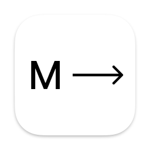

> <em>Redesigned by Ryan Martin in <a href="https://github.com/mutium">Mutium</a></em>

Streamline team collaboration with real-time communication and file sharing.

  

  Mium is a widely used team collaboration tool designed to improve communication and collaboration efficiency among teams. It provides a platform that integrates various functionalities and tools, allowing team members to engage in real-time communication, share files, organize work, and manage projects all in one place.

  &nbsp;
  &nbsp;

